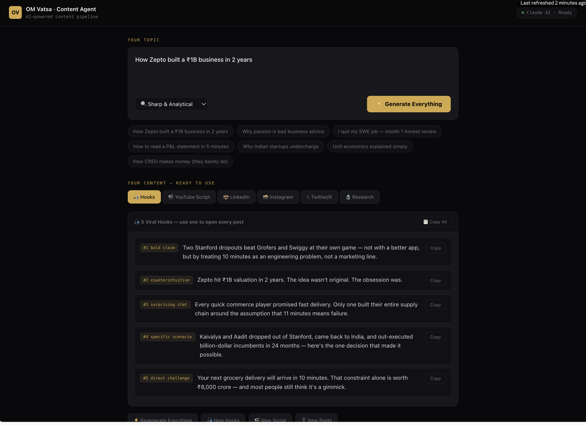

# OM Vatsa — AI Content Agent 🤖⚡

> An AI-powered content pipeline that turns a single business topic into a full week of content across YouTube, LinkedIn, Instagram, and Twitter/X — in under 60 seconds.

**Built by [Om Vatsa](https://github.com/onkar-01) · Software Engineer**

---

## What it does

You type a topic. The agent does everything else:

| Output | Details |
|---|---|
| 🔬 **Research Brief** | Key facts, data points, India context, contrarian angles |
| 🎣 **5 Viral Hooks** | Ready-to-use openers for every platform |
| 🎬 **YouTube Script** | Full 7–10 min timestamped script, written as you'd say it on camera |
| 💼 **LinkedIn Post** | 150–250 words, hook-first, comment-driving question |
| 📸 **Instagram Caption** | With hashtags + separate 45–60 sec Reel script |
| 𝕏 **Twitter/X Thread** | 6–8 tweets, numbered, hook-optimised |

---

## Demo

<video src="src/assets/agent_demo_video.mov" width="100%" controls></video>



---


## Tech Stack

- **React** (functional components + hooks)
- **Claude Sonnet 4.6** via Anthropic API
- **Sequential API calls** with auto-retry on rate limits
- Zero backend — runs entirely in the browser via Claude's proxy

---

## Getting Started

### Option 1 — Run on Claude.ai (easiest)

1. Go to [claude.ai](https://claude.ai)
2. Open a new conversation
3. Upload `App.jsx` and say: *"Run this React artifact"*
4. Done — no setup, no API key needed

### Option 2 — Run locally

```bash
# Clone the repo
git clone https://github.com/onkar-01/content-creation-agent.git
cd content-creation-agent

# Install dependencies
npm install

# Add your Anthropic API key
cp .env.example .env
# Edit .env and add: VITE_ANTHROPIC_API_KEY=your_key_here

# Start dev server
npm run dev
```

> ⚠️ **Note:** Running locally requires your own Anthropic API key from [console.anthropic.com](https://console.anthropic.com). The claude.ai version works without a key.

---

## How it works

The agent runs **4 sequential Claude API calls** (not parallel — to avoid rate limits):

```
1. Research Brief     →  wait 1.2s
2. 5 Viral Hooks      →  wait 1.2s
3. YouTube Script     →  wait 1.2s
4. All Platform Posts →  done
```

All 4 social posts (LinkedIn, Instagram caption, Reel script, Twitter thread) are generated in a **single combined call** using section markers — cutting total API calls from 7 to 4.

Auto-retry logic handles 429 rate limit errors with exponential backoff (8s → 16s → 24s).

---

## Project Structure

```
content-creation-agent/
├── App.jsx          # Main React component — the entire agent
├── README.md        # This file
├── .env.example     # Environment variable template
└── package.json     # Dependencies
```

---

## Tone Options

The agent supports 5 content tones:

- 🔍 **Sharp & Analytical** — data-driven, precise
- ⚡ **Contrarian & Bold** — unpopular opinions, hot takes
- 📖 **Personal Story** — first-person journey content
- 📚 **Educational & Clear** — beginner-friendly breakdowns
- 💬 **Conversational** — casual, relatable

---

## Idea Chips (built-in starters)

- How Zepto built a ₹1B business in 2 years
- Why passion is bad business advice
- I quit my SWE job — month 1 honest review
- How to read a P&L statement in 5 minutes
- Why Indian startups undercharge
- Unit economics explained simply
- How CRED makes money (they barely do)

---

## Contributing

PRs welcome. If you want to add:
- More platform outputs (YouTube description, newsletter draft)
- Tone presets for different creator niches
- Local storage to save past generated content

Open an issue first so we can align on the approach.

---

## About

I'm **Om Vatsa** — software engineer,  creating something new for ambitious Indian college students and 20-somethings who want to build, not just work.


- 💼 LinkedIn: [Om Vatsa](https://linkedin.com/in/onkar-vatsa-2478b5212/)

---

## License

MIT — use it, fork it, build on it. Just give credit.

---

*Built with Claude AI · Made for creators who think like engineers*
